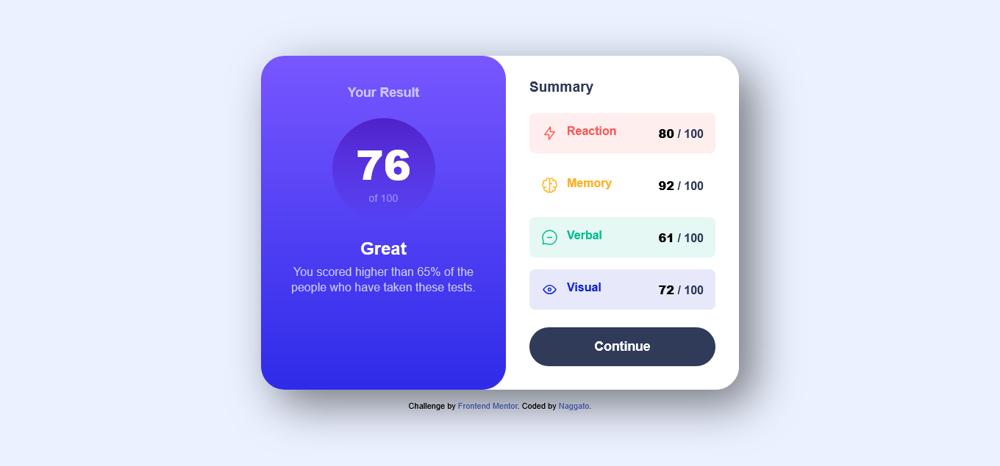

# Frontend Mentor - Results summary component solution

This is a solution to the [Results summary component challenge on Frontend Mentor](https://www.frontendmentor.io/challenges/results-summary-component-CE_K6s0maV). Frontend Mentor challenges help you improve your coding skills by building realistic projects. 

## Table of contents

- [Overview](#overview)
  - [The challenge](#the-challenge)
  - [Screenshot](#screenshot)
  - [Links](#links)
- [My process](#my-process)
  - [Built with](#built-with)
  - [What I learned](#what-i-learned)
  - [Continued development](#continued-development)
- [Author](#author)
- [Acknowledgments](#acknowledgments)

## Overview

### The challenge

Users should be able to:

- View the optimal layout for the interface depending on their device's screen size
- See hover and focus states for all interactive elements on the page
- **Bonus**: Use the local JSON data to dynamically populate the content

### Screenshot



### Links

- Solution URL: [https://github.com/eneasdutra/results-summary-component](https://github.com/eneasdutra/results-summary-component)
- Live Site URL: [https://eneasdutra.github.io/results-summary-component/](https://eneasdutra.github.io/results-summary-component/)

## My process

### Built with

- Semantic HTML5
- CSS Custom Properties (Variables)
- **HSL** Color Format
- Flexbox
- **BEM** (Block Element Modifier) ​​Methodology
- **Mobile-first** Workflow
- Vanilla JavaScript (Fetch API for loading JSON)

### What I learned

In this project, I focused on keeping the code clean and organized. I learned how to manipulate the DOM 
to render dynamic components from an external `.json` file, which makes the application more scalable.

Emphasis is placed on the use of CSS variables with transparency in HSL:

```css
/* Exemplo de como usei transparência para os fundos das categorias */
.summary-item[data-category="reaction"] {
  background-color: hsla(0, 100%, 67%, 0.1); 
  color: hsl(0, 100%, 67%);
}
```
And the asynchronous logic for loading the data:

```js
async function loadSummary() {
  const response = await fetch('./data.json');
  const data = await response.json();
  // Rendering of the items...
}
```
### Continued development

I intend to continue exploring the manipulation of external data and delve deeper into CSS animations 
to make transitions between hover states even smoother.

## Author

- Frontend Mentor - [@eneasdutra](https://www.frontendmentor.io/profile/eneasdutra)
- Linkedin - [@eneasmdutra](https://www.linkedin.com/in/eneasmdutra/)
-Github - [@eneasdutra](https://github.com/eneasdutra)

## Acknowledgments

I thank the Frontend Mentor team for providing such inspiring designs for practice.
